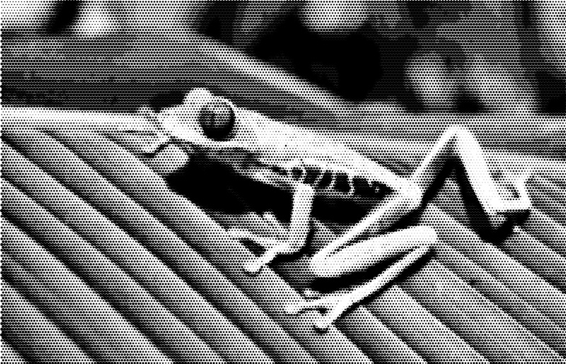
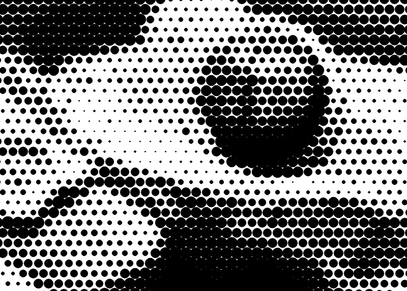

# Artbot

This is a small and fun collection of some of my image processing effects, all written in Python. It all started as a small weekend project with an idea to vectorize bitmap images with artsy effects and to print those using pen plotter (hence the name 'artbot'). This is the intermediate release that saves images to bitmap format, and there have been some deviations from the original concept (e.g. using colors).

All effects take bitmap image as input and then re-draw the image using lines or circles. All image data is processed as NumPy arrays. OpenCV drawing functions are used to render the output image. 

The program is run using command `python3 artbot.py inputfile outputfile effectname`, where inputfile is the source image file name. The processing result will be saved to outputfile. Effectname specifies the used effect (circles, dots, scribble or color_scribble). 

# Code

The processing pipelines are defined in the artbot.py file. All the algorithms produce result image that has same resolution as the input image (img), so the input image is resized to the target resolution. Most algorithms work best with images that have 3000 pixels in the longest side of the image. The resolution is defined in the artbot.py file. The algorithms are not hardcoded to any specific resolution or aspect ratio, but there are parameters that may need to be tuned for best visual experience if the resolution is changed significantly. 

The code uses OpenCV (CV2 Python library) to open and save image files, so all the CV2 compatible file formats are supported. 

There are also sharpening, softening and dithering functions that can be added as intermediate steps. Especially the scribble may need dither if the source image has large areas of exactly the same color. Feel free to play with the algorithms to find the settings that work for you. 

All algorithms take image array (NymPy array) as input and return the result image array. Internal processing is done in RGB or grayscale format instead of the CV2 default BGR. 

In this code example (from artbot.py) the scribble effect pipeline is described: 

```python
scaling = 3000 / max(img.shape[0], img.shape[1])
tmp = cv2.cvtColor(img, cv2.COLOR_RGB2GRAY)
tmp = cv2.resize(tmp, (0,0), fx=scaling, fy=scaling)
tmp = histogram_equalize(tmp)
result = mono_scribble(tmp)
```

The algorithm implementations are quite well commented in the code, so that may be the best place to look for details. Some of the algorithms also contain heavy optimizations for processing speed, which are also described there. 

All the code is released under the MIT license. 

## Dependencies

The code relies heavily on NumPy and OpenCV (CV2) libraries. Matplotlib Pyplot is used for displaying the result image. 
The code was tested with following versions:
* NumPy version 1.13.3
* CV2 version 3.3.0
* Matplotlib version 2.1.0 

Other libraries are the usual Python standard libraries. Python 3 coding style is used. 


# Samples 

In all the below examples the same frog photo is used as the input file. It is free photo from Pixabay user "12019". 


## color_scribble

This algorithm works from dark background towards light, i.e. the line density is highest at areas where the original image is light. The line colors are picked from the original image. The scribble line is one continuous line and typically there are about 100 to 500 thousand curves in the line, depending on the original image brightness level. 

The longest side of the output image is always 3000 pixels in order to keep the resolution at good level, but that can be adjusted from the code. In a 2015 MacBook Pro it takes about one minute to run this algorithm. 

Full image


Detail


## scribble 

This is very similar to the color_scribble described above, but this works in a monochrome way by drawing a dark line on a light background. Line density is highest at the areas where original image is darkest. The colors can be adjusted from the code.


Detail


## circles

This algorithm packs the image area with circles as tightly as possible, starting from a random location, and then draws the circles using colors picked from the original image. The circles can be rendered 'soft' like in the samples below or using flat color for sharper look. 


Detail


## dots

This is traditional halftone style algorithm that produces black dots that vary in size depending on the original image grayscale values.



Detail


